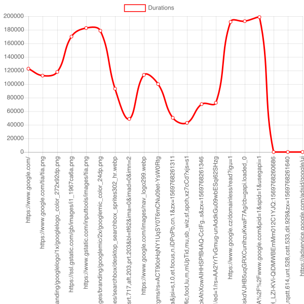

## Measure page requests and draw them on chart.

This code just opens a page (www.google.com) in Puppeteer Chrome automation with tracing enabled. For each request it calculates its duration and makes a chart from them.

Kind of what Chrome better with its Performace tab in DevTools.
The data captured by performance Trace are in json form and has lots ot other interestring insights. This is just a quick test.

### Chart looks like:

### Dependencies
MacOs

brew install pkg-config
brew install freetype
brew install cairo
